# Space-Capacity-Automation

<b> [Latest Code of [usp_AnalyzeSpaceCapacity]](Space-Capacity-Procedure/dbo.usp_AnalyzeSpaceCapacity.sql)</b>

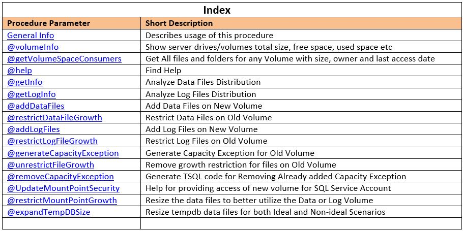

### General Info
This automation has been designed to eliminate manual efforts on Space Capacity ESC tickets where DBA has to add new data or log files on new volume, and restrict data or log files on old volume. Apart from this, this procedure can be used for variety of tasks related to capacity management. 

For example, say, on server dbTest1774, a new data volume <b>E:\Data1\ </b> has been added. So, DBA has to add new data files on <b>@newVolume</b> (E:\Data1\) and restrict data files on <b>@oldVolume</b> (E:\Data\). This can be accomplished by below methods:-  
<i>EXEC [dbo].[usp_AnalyzeSpaceCapacity] @addDataFiles = 1 ,@newVolume = 'E:\Data1\' ,@oldVolume = 'E:\Data\';</i>  
This generates TSQL code for adding data files on <b>@newVolume</b> for data files present on <b>@oldVolume</b> for each combination of database and filegroup.  
In case, we don’t want TSQL code generation, rather wish to execute it right away, we can execute procedure with @forceExecute parameter.  
<i>EXEC [dbo].[usp_AnalyzeSpaceCapacity] @addDataFiles = 1 ,@newVolume = 'E:\Data1\' ,@oldVolume = 'E:\Data\' ,@forceExecute = 1;</i>

Similarly the procedure [dbo].[usp_AnalyzeSpaceCapacity] can be used for multiple activities related to space capacity.

### Find Help (@help)
The parameter provides directions on how to use this procedure. It also presents 12 examples in it.
 
<i>exec dbo.[usp_AnalyzeSpaceCapacity] @help = 1</i>

Also, below are the parameters for procedure with default values:- 
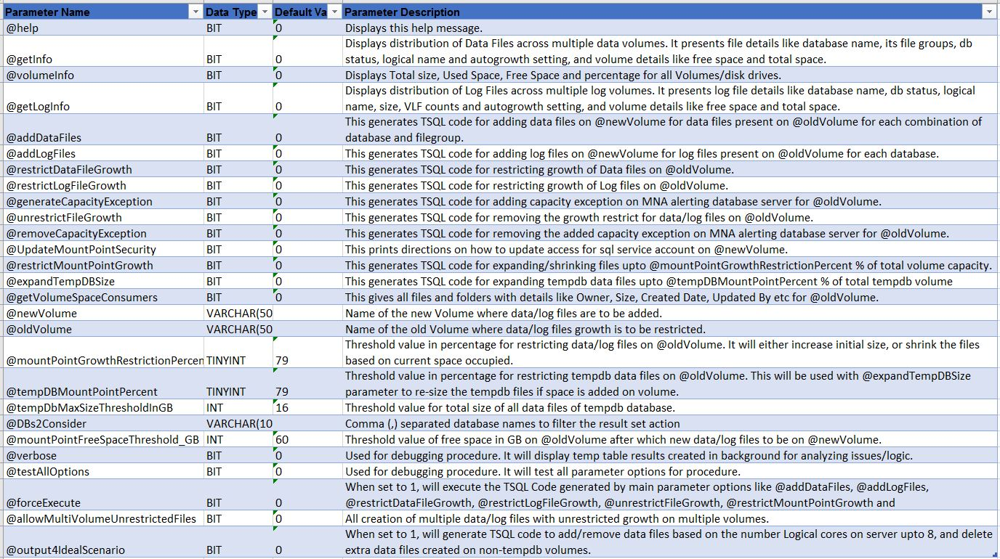

For best result, always take out help from procedure using @help parameter. Below are few examples in Messages tab:-

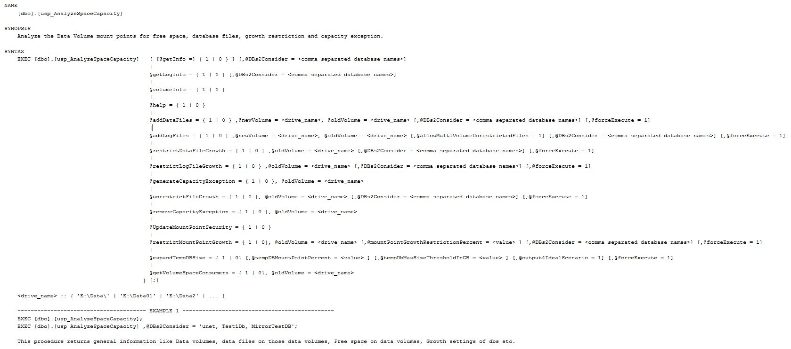
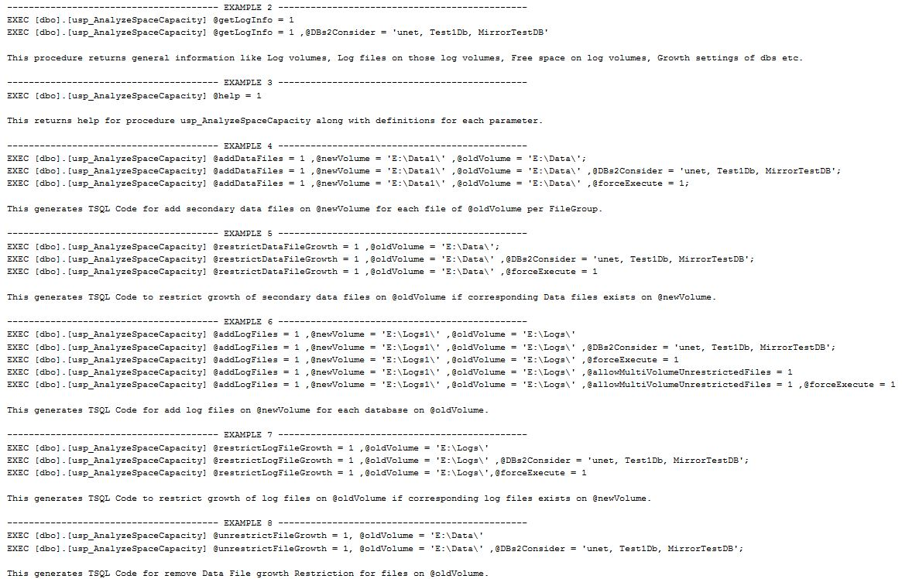
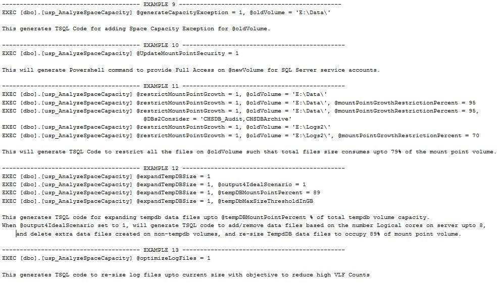

### Analyze Data Files Distribution (@getInfo)

This parameter is used to display distribution of Data Files across multiple data volumes. It presents file details like database name, its file groups, db status, logical name and auto growth setting, and volume details like free space and total space. 

Below is a sample output:-

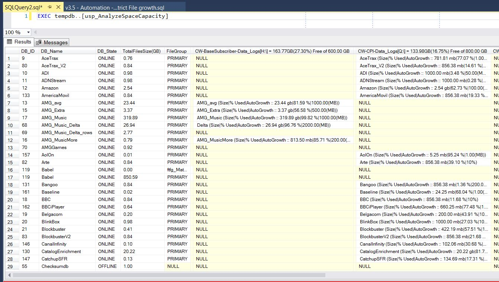

### Analyze Log Files Distribution (@getLogInfo)

This parameter is used to display distribution of Log Files across multiple log volumes. It presents file details like database name, db status, logical name, size, auto growth setting and VLF counts, and volume details like free space and total space. 

Below is a sample output:-

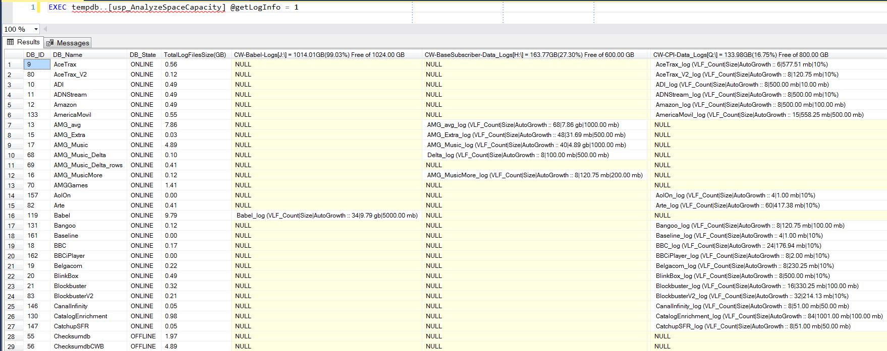

### Displays Total size, Used Space, Free Space and percentage for all Volumes/disk drives(@volumeInfo)

This parameter is used to display space utilization of all available online disk drives or mounted volumes. This includes Volume, Label, [capacity(GB)], [freespace(GB)], [UsedSpace(GB)], [freespace(%)] and [UsedSpace(%)].

Below is a sample output:-

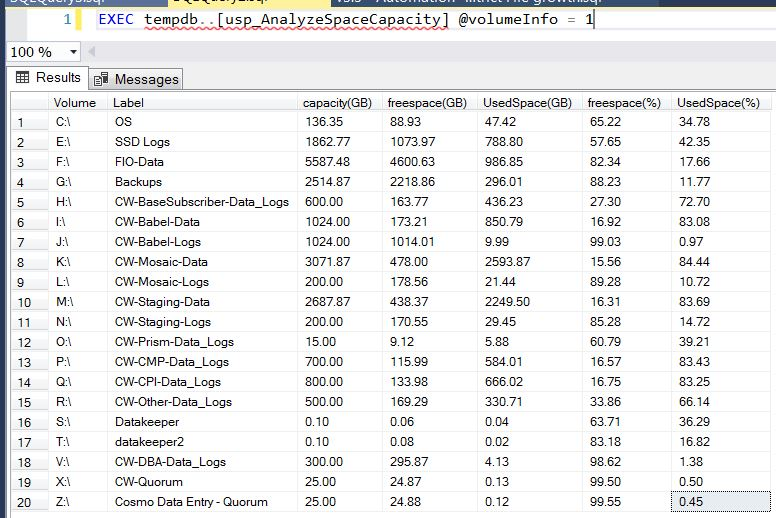

### Displays All Files & Folders consuming space on volume/disk (@getVolumeSpaceConsumers)

This parameter results all the files and folder including all nested child items for path provided in @oldVolume parameter. This includes IsFolder, Name, Size, TotalChildItems, Owner, CreationTime, LastAccessTime and LastWriteTime.

Below is a sample output:-

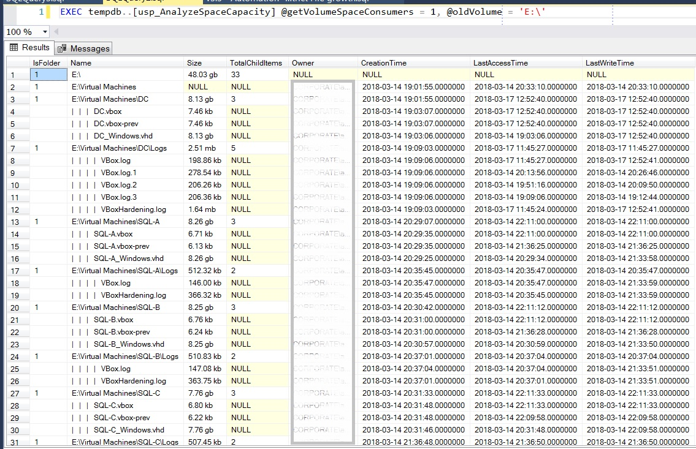

### Add Data Files on New Volume (@addDataFiles)

This generates TSQL Code for add secondary data files on @newVolume for each file of @oldVolume per FileGroup. In case a data file for same database and filegroup already exists on @newVolume, then code is generated to un-restrict the growth of data file on @newVolume.

EXEC [dbo].[usp_AnalyzeSpaceCapacity] @addDataFiles = 1 ,@newVolume = 'F:\' ,@oldVolume = 'E:\Data\';

<b>Output:-</b>

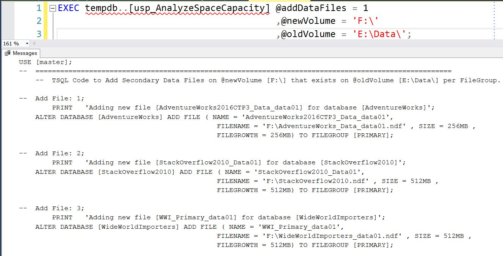

If we execute above query with one extra parameter <b>@forceExecute = 1</b>, then rather than generating TSQL code, the generated TSQL script are executed in background and presented with final output message showing each script executed, database and filegroup names, and success/failure message.  Below is sample screenshot:-

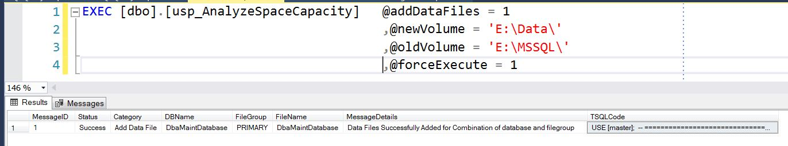

### Add Log Files on New Volume (@addLogFiles)

This generates TSQL Code for add log files on @newVolume for each log file of @oldVolume. In case a log file for same database already exists on @newVolume, then code is generated to un-restrict the growth of that log file on @newVolume.

EXEC [dbo].[usp_AnalyzeSpaceCapacity] @addLogFiles = 1 ,@newVolume = 'F:\Logs' ,@oldVolume = 'E:\Data\'; 

<b>Output:-</b>

If we execute above query with one extra parameter <b>@forceExecute = 1</b>, then rather than generating TSQL code, the generated TSQL script are executed in background and presented with final output message showing each script executed with success/failure message.  Below is sample screenshot:-

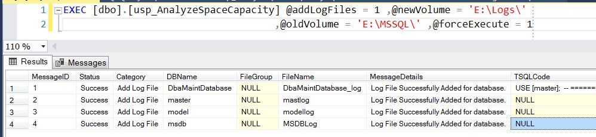

### Restrict Data Files (@restrictDataFileGrowth)

This generates TSQL Code to restrict growth of data files on @oldVolume if alternate data files with un-restricted growth are present on other volumes.

EXEC [dbo].[usp_AnalyzeSpaceCapacity] @restrictDataFileGrowth = 1 ,@oldVolume = 'E:\Data\';

EXEC [dbo].[usp_AnalyzeSpaceCapacity] @restrictDataFileGrowth = 1 ,@oldVolume = 'E:\Data\' ,@forceExecute = 1;

<b>Output:-</b>

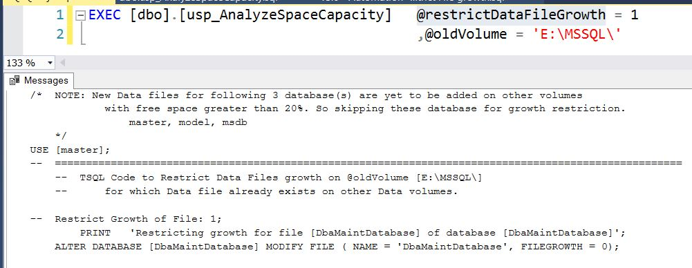

### Restrict Log Files (@restrictLogFileGrowth)

This generates TSQL Code to restrict growth of log files on @oldVolume when log files with un-restricted growth are present on other volumes.

EXEC [dbo].[usp_AnalyzeSpaceCapacity] @restrictLogFileGrowth= 1 ,@oldVolume = 'E:\Logs\';

EXEC [dbo].[usp_AnalyzeSpaceCapacity] @restrictLogFileGrowth = 1 ,@oldVolume = 'E:\Logs\' ,@forceExecute = 1;

Output:-

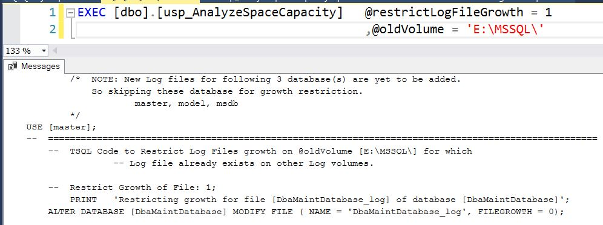

### Resize tempdb files (@expandTempDBSize)

This generates TSQL code for expanding tempdb data files up to @tempDBMountPointPercent (default 89%) of total tempdb volume capacity. When @output4IdealScenario set to 1, will generate TSQL code to add/remove data files based on the number Logical cores on server up to 8, and delete extra data files created on non-tempdb volumes.

When we need to restrict tempdb files total size to a specific value, then use <b>@tempDbMaxSizeThresholdInGB</b>  = <size in gb>.
 
EXEC [dbo].[usp_AnalyzeSpaceCapacity] @expandTempDBSize = 1, @tempDbMaxSizeThresholdInGB = 6;

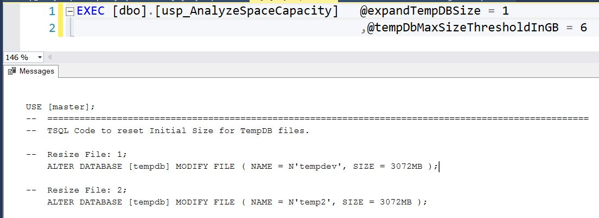

When we need to restrict tempdb files total size to a specific % of drive space, then use <b>@tempDBMountPointPercent</b>  = <% space of total drive space>.
 
EXEC [dbo].[usp_AnalyzeSpaceCapacity] @expandTempDBSize = 1, @tempDBMountPointPercent = 89;

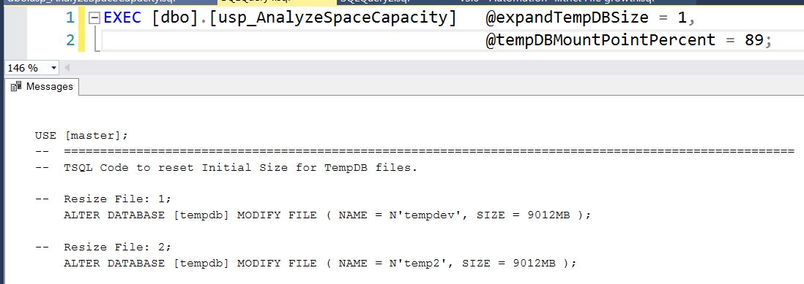

